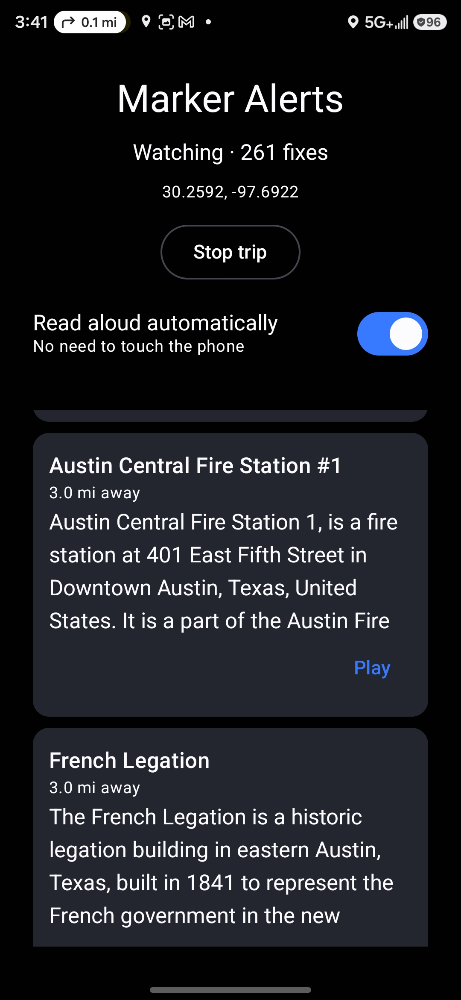
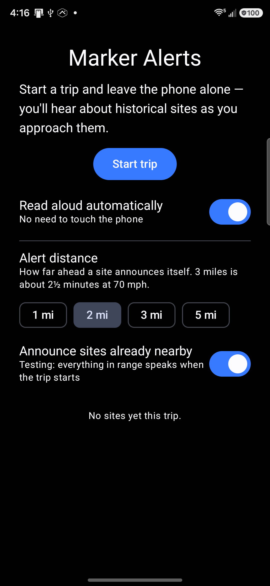
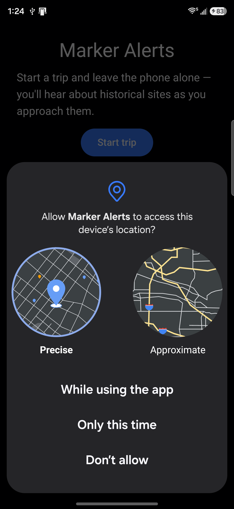

# Marker Alerts

[](https://github.com/dnoeltx/historical-marker-alerts/actions/workflows/ci.yml)

An Android app for road trips. Start a trip, put the phone in its holder, and it
notices when a historical site is coming up and tells you about it — roughly
three miles out, which is about two and a half minutes of warning at highway
speed. Enough time to decide whether to take the exit.

It works entirely offline: 7,084 National Register of Historic Places sites
across Texas, Colorado, New Mexico, Arizona and Utah ship inside the APK, so it
keeps working through the parts of west Texas and southern Utah where there is
no signal at all.

Built as a hands-on project for learning modern Android development with
AI-assisted coding. Signed release builds are published automatically on the
[Releases page](https://github.com/dnoeltx/historical-marker-alerts/releases).

## Screenshots

| Mid-drive | Start a trip | Permission |
|:--:|:--:|:--:|
|  |  |  |

The first is a real drive east of Austin — 261 location fixes in, two sites
already announced, and a navigation instruction visible in the status bar
because the whole point is that this runs alongside your map app rather than
instead of it.

The permission dialog is worth a second look: it offers **"While using the
app"**, not "Allow all the time". That is a design decision, described under
[Location without background permission](#location-without-background-permission).

## The interesting problem: relevance

The National Register is a property list, not a list of attractions. A typical
row is *"Barr, William Braxton, House"* — a private residence, listed for its
architecture, with nothing to tell you and nowhere to stop. Alerting on all
7,084 would be unusable noise, and the dataset has no field that separates
"worth a detour" from "someone's house".

The rule this app uses: **a site earns an alert only if a Wikipedia article was
matched to it during ingestion.** If no one wrote an article about it, there is
nothing to read aloud, and it almost certainly is not worth stopping for. One
rule solves relevance and content at the same time.

That takes 7,084 sites down to **936 alertable** — 13.2%.

| State | Sites | Alertable | |
|---|--:|--:|--:|
| Texas | 2,745 | 320 | 11.7% |
| Utah | 1,391 | 242 | 17.4% |
| Colorado | 1,170 | 176 | 15.0% |
| Arizona | 1,109 | 67 | 6.0% |
| New Mexico | 669 | 131 | 19.6% |

Arizona is an unexplained outlier and is on the list to investigate.

Matching a National Register name to a Wikipedia title is harder than it looks.
The register stores names inverted (*"Barr, William Braxton, House"*), Wikipedia
disambiguates in parentheses (*"Paramount Theatre (Austin, Texas)"*), and a
naive similarity score produces confident nonsense:

- *"Cedar Fort School"* matched *"Cedar Fort"* — the town — at 1.00, because
  containment divided by the shorter of the two names. Similarity is now
  **directional**: it divides by the marker's tokens, so extra words in the
  marker count against the match.
- *"Rio Grande Southern Railroad Engine No. 20"* matched *"…Motor No. 6"* at
  0.71. A **numeric veto** now rejects any pair whose numbers disagree.

The acceptance threshold is 0.8, chosen by reading the weakest accepted matches
on a real sample rather than by picking a round number. A wrong blurb read aloud
is worse than silence.

## How it works

### Proximity without the Geofencing API

Android's geofencing API caps you at 100 active fences. With thousands of sites
that would mean maintaining a rolling nearest-100 window — real complexity for
no benefit. Instead each location fix runs an indexed bounding-box query and
then refines it:

```sql
SELECT * FROM markers
WHERE alertable = 1
  AND lat BETWEEN ? AND ?
  AND lon BETWEEN ? AND ?
```

with a composite index on `(lat, lon)`, and the longitude delta corrected by
`cos(latitude)` — a degree of longitude is about 62 miles in south Texas and
about 52 at the Colorado–Wyoming line. SQL does the cheap indexed work that eliminates
99.9% of rows; Kotlin does the Haversine trigonometry on the handful that
survive. Doing the distance maths in SQL instead would force a full table scan
on every fix, because no index can help an expression.

### Location without background permission

The app never requests `ACCESS_BACKGROUND_LOCATION` — it is not even declared in
the manifest. Instead, "Start trip" launches a **foreground service** with
`foregroundServiceType="location"` while the app is visible. That service keeps
receiving location with the screen off and the phone locked, holding only
"While using the app" permission.

Verified on a physical device: across a screen-lock and doze cycle the service
survives with the same `ServiceRecord`, and location is still delivered every
four seconds with the client classified `foreground`. Without the foreground
service, Android throttles background location to a handful of fixes an hour.

### Speech that behaves in a car

Blurbs are read aloud with `TextToSpeech`, tagged as
`USAGE_ASSISTANCE_NAVIGATION_GUIDANCE` so a car head unit routes it like
turn-by-turn directions, and audio focus is requested as
`GAIN_TRANSIENT_MAY_DUCK` so music ducks rather than pausing.

Alerts can arrive closer together than they take to say — measured on-device,
speech runs at about 12.3 characters per second, so a typical 283-character
blurb takes around 23 seconds while two alerts can land 500 m apart. `SpeechQueue`
therefore **queues** rather than interrupting, holds audio focus across the whole
run instead of per utterance (otherwise music ducks and un-ducks between sites),
and drops anything that has waited more than 90 seconds — by then you have
driven past it, and "coming up" would be a lie.

## Data sources and licensing

- **National Register of Historic Places** (National Park Service) — public
  domain. Fetched from the NPS ArcGIS feature service.
- **Wikipedia** — article extracts under
  [CC BY-SA](https://creativecommons.org/licenses/by-sa/4.0/). Every alertable
  site stores the article title and URL, shown in the app; spoken alerts end
  with "From Wikipedia."
- **HMdb.org is deliberately not used.** It has the best content by far —
  250,000 markers with full inscriptions — but no public API and its text is
  contributor-copyrighted, so it is off-limits regardless of how useful it
  would be.

## Tech stack

- **Kotlin**, **Jetpack Compose**, **Material 3**
- **Room** over a prebuilt SQLite asset via `createFromAsset`, with **KSP**
- **Play Services Location** (fused provider) behind a `LocationSource` interface
- **`TextToSpeech`** and **`AudioManager`** — no third-party audio dependency
- A separate **`:tools`** JVM Gradle module for the ingestion pipeline, written
  in Kotlin rather than Python so the whole project stays in one language and
  needs no second toolchain

Architecture: `TripService` (a foreground `LifecycleService`) owns a
`ProximityDetector` and reads from a Room DAO. Everything with interesting logic
— the detector, `SpeechQueue`, `Utterance`, the matcher — is plain Kotlin behind
an interface, so it is testable on the JVM without a device.

## The data pipeline

`:tools` runs once, offline, and produces the SQLite file committed as an app
asset:

```bash
./gradlew :tools:run --args="--out app/src/main/assets/markers.db"
```

1. Fetch by state from the NPS feature service, paginating 2,000 rows at a time.
2. Plan a Wikipedia harvest **around the sites rather than over a grid** — a
   lattice covering five states is mostly empty desert. Query centres are placed
   on sites, skipping any site already within 10 km of a previous centre, so
   cost scales with density instead of area.
3. Match each site to a nearby article by distance and directional name
   similarity, then pull the article summary as the blurb.
4. Write the database and stamp `room_master_table` with Room's identity hash,
   without which Room refuses to open a prepackaged file.

Every HTTP response is cached on disk, so re-running to tune the similarity
threshold costs nothing but CPU. `--refresh` and `--max-age-days` exist because
otherwise the cache would defeat a genuine data refresh — rebuilding an
identical database while reporting success.

## Testing

68 unit tests, all on the JVM.

- **Route replay.** A 600-mile drive cannot be a test loop, so `RouteReplay`
  drives the detector along a synthetic route and reports what fired and where.
  This immediately exposed an **alert storm**: 71 alerts on Austin → Denver, a
  median gap of 0.0 km, firing at 81 m — i.e. after you had already passed. Now
  20 alerts, a 0.5 km median gap, firing at 4,300–4,800 m. The cause was cities,
  not the historic-district clustering that had been predicted.
- **Robolectric DAO tests** open the real prepackaged database, which is what
  proves the hand-written pipeline schema and Room's compiled schema agree.
- **Mutation testing** to prove the suite is not vacuous — deliberately breaking
  a behaviour and confirming tests fail. Removing the one line that makes speech
  queue rather than interrupt fails 5 of 13 `SpeechQueueTest` cases.

## CI/CD

- Every pull request and every push to `main` compiles both modules and runs
  both test suites. `main` is protected and requires the check to pass.
- Pushing a `v*` tag builds a signed release APK, verifies with `apksigner` that
  it really is release-signed, checks the marker database actually shipped
  inside it, and publishes a GitHub Release. Signing credentials come from
  repository secrets; no keystore or password is in the repo.

## Requirements

- Android 8.0 (API 26) or newer — the app is built around notification channels
- Location permission ("While using the app" is sufficient)
- Notification permission on Android 13+, or alerts arrive silently

## Building & running

```bash
git clone https://github.com/dnoeltx/historical-marker-alerts.git
cd historical-marker-alerts
./gradlew :app:installDebug
```

The JDK is pinned to Temurin 21 by `gradle/gradle-daemon-jvm.properties`, so
Gradle will provision it if it is missing rather than using whatever happens to
be on the path.

## Known limitations

- Coverage is five states. The national dataset is 72,668 sites; the indexing
  strategy was chosen with that in mind.
- No map. The data model keeps coordinates for one, but v1 is audio-first.
- Alerts appear on the phone, not on an Android Auto display — a car surface
  needs a car-app category and is well beyond v1.
- Driving-mode Do Not Disturb can demote notifications to the shade with no
  banner, which would make alerts easy to miss.
